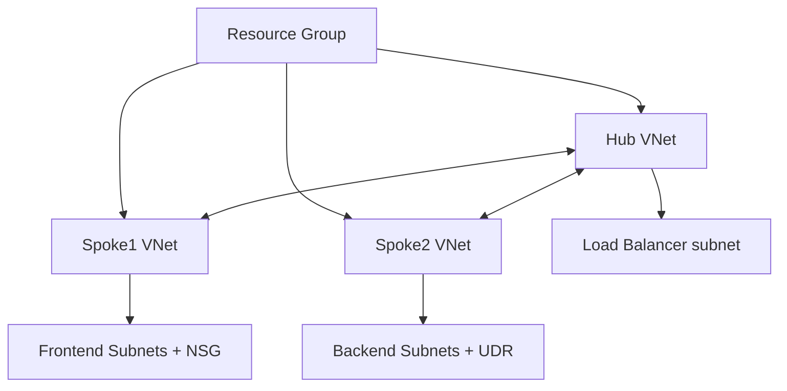

# Terraform IaC — Azure Hub-Spoke Network

Automated deployment of a **Hub-and-Spoke** network infrastructure in Microsoft Azure using Terraform.

## 🎯 Project Overview

This project deploys a complete, production-ready **Hub-and-Spoke** networking architecture in Azure:

- **1 Hub** Virtual Network (central hub)
- **2 Spoke** Virtual Networks (workload networks)
- VNet Peering between Hub and all Spokes
- Network Security Groups (NSG) with predefined rules
- Internal Load Balancer in the Hub
- Private DNS Zone
- Route Tables with force-tunnel example
- Consistent tagging and Azure best practices

## 🏗 Architecture

🚀 Quick Start
Prerequisites

Terraform ≥ 1.10
Azure CLI (logged in)
Azure subscription

📁 Project Structure

.
├── main.tf                 # Main file (resource group + module calls)
├── variables.tf            # Input variables
├── locals.tf               # Local values and tags
├── providers.tf
├── versions.tf
├── modules/
│   ├── vnet/               # Virtual Network + Subnets
│   ├── peering/            # VNet Peering (Hub ↔ Spokes)
│   ├── nsg/                # Network Security Groups
│   ├── lb/                 # Load Balancer
│   ├── private_dns/        # Private DNS Zone
│   └── route_table/        # Route Tables (UDR)
└── README.md

### ⚙️ Main Variables

| Variable                  | Description                              | Default                  |
|---------------------------|------------------------------------------|--------------------------|
| `rg_name`                 | Resource Group name                      | `rg-iac-azure-1-2`      |
| `location`                | Azure region                             | `westeurope`            |
| `vnets`                   | Configuration of all VNets               | (see `variables.tf`)    |
| `number_of_lb`            | Number of Load Balancers                 | `1`                     |
| `private_dns_zone_name`   | Private DNS zone name                    | `development.local`     |
| `nsg_rules`               | NSG security rules                       | `{}`                    |
| `next_hop_in_ip_address`  | Next hop IP (Firewall/NVA)               | `10.0.1.5`              |
| `tags`                    | Additional resource tags                 | `{}`                    |

Full variable documentation is available in [`variables.tf`](variables.tf).